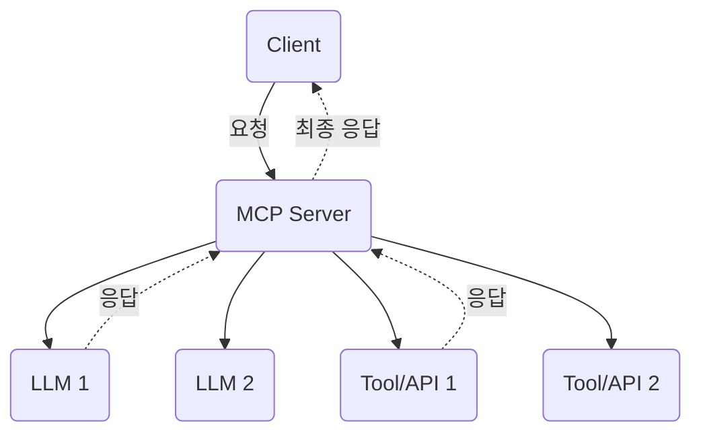

<!-- Mermaid JS 자동 변환 스크립트 -->

# MCP란 무엇인가?

---

## 1. 정의

**Model Context Protocol(MCP)**는 다양한 LLM(대형언어모델)과 툴, 리소스, DB, 에이전트를  
하나의 서버/프로토콜 위에서 통합 관리할 수 있도록 해주는 오픈소스 표준입니다.

---

## 2. 주요 특징

- **멀티모델**: OpenAI, Claude, Gemini 등 다양한 LLM 지원  
- **멀티툴**: 외부 API, DB, 크롤러, 코드 실행 등 툴 통합  
- **확장성**: Function Call/Tool Call과 유사하지만 훨씬 유연하고 구조적임  
- **표준화**: 클라이언트-서버 구조, 다양한 언어 SDK 지원

---

## 3. 구조(다이어그램)

아래는 MCP 시스템의 개념도입니다.

## 4. 용어 정리

- **Client** : 질문/명령을 보내는 주체 (앱, 웹 등)
- **MCP Server** : 요청을 받아 적절한 LLM/Tool/Resource로 분배/관리
- **Model** : OpenAI, Gemini, Claude 등 LLM 엔진
- **Tool/Resource** : DB, 외부API, 웹크롤러, 코드 실행 등 확장 리소스

## 5. 실제 활용 예시

- 다중 AI모델 기반 채팅봇, 멀티에이전트 분석시스템
- 데이터 수집 자동화, 실시간 웹크롤러
- 업무 자동화, 파이프라인(워크플로우) 설계 등

---

[🔙 메인으로](index.md) | [다음: 코드 예제](mcp-examples.md)