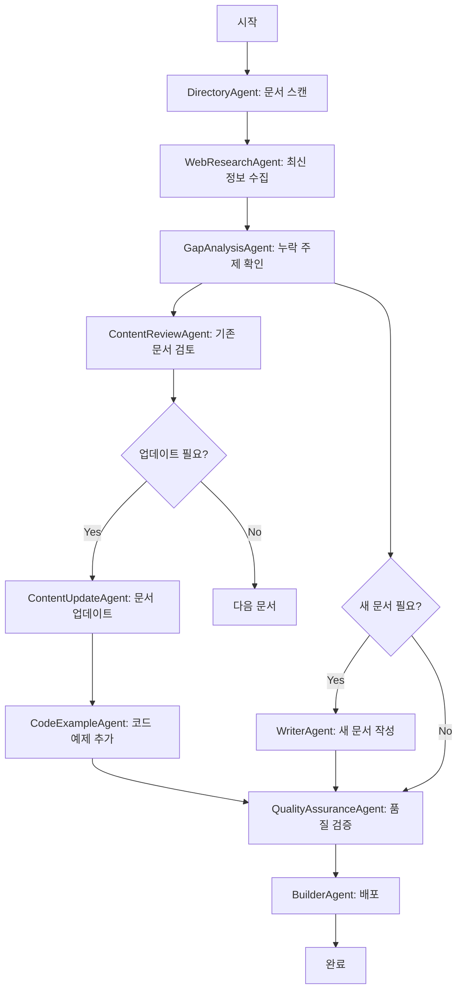

# MCP 교육 자료 자동 업데이트 Multi-Agent System

## 🎯 시스템 개요

이 시스템은 여러 특화된 AI Agent들이 협력하여 MCP(Model Context Protocol) 교육 자료를 자동으로 검토, 업데이트, 개선하는 통합 시스템입니다.

## 🤖 Agent 구성 및 역할

### 1. DirectoryAgent (`directory_agent.py`)
**역할**: 문서 디렉토리 감사관
- `docs/` 폴더의 모든 마크다운 파일 스캔
- 각 문서의 메타데이터(제목, 첫 줄 등) 수집
- 현재 문서 구조 상태를 state에 저장

**사용 도구**:
- `list_files`: 파일 목록 검색
- `read_file`: 파일 내용 읽기

### 2. WebResearchAgent (`web_research_agent.py`)
**역할**: 최신 정보 연구원
- MCP 관련 최신 정보 웹 검색
- 공식 문서, 튜토리얼, 베스트 프랙티스 수집
- 변경사항 및 업데이트 내용 파악

**사용 도구**:
- `web_search`: 웹 검색 수행

### 3. GapAnalysisAgent (`gap_agent.py`)
**역할**: 콘텐츠 갭 분석가
- 현재 문서에서 누락된 주제 식별
- 필요한 새 문서 목록 생성
- 교육 커버리지 완성도 평가

**사용 도구**:
- 내부 로직 기반 분석

### 4. ContentReviewAgent (`content_review_agent.py`)
**역할**: 콘텐츠 검토 전문가
- 문서의 정확성 및 최신성 검토
- 오래된 정보 식별
- 개선이 필요한 섹션 표시

**사용 도구**:
- `check_freshness_and_accuracy`: 신선도/정확성 체크
- `analyze_content_freshness`: 상세 콘텐츠 분석

### 5. ContentUpdateAgent (`content_update_agent.py`)
**역할**: 콘텐츠 업데이트 담당자
- 검토 결과를 바탕으로 실제 업데이트 수행
- 새로운 정보 추가 및 오래된 정보 수정
- 일관된 스타일과 포맷 유지

**사용 도구**:
- `read_file`: 현재 콘텐츠 읽기
- `write_file`: 업데이트된 콘텐츠 저장
- `generate_educational_content`: 교육 콘텐츠 생성

### 6. WriterAgent (`writer_agent.py`)
**역할**: 신규 문서 작성자
- Gap 분석 결과를 바탕으로 새 문서 생성
- 표준화된 템플릿 사용
- 초기 콘텐츠 구조 설정

**사용 도구**:
- `write_file`: 새 파일 생성

### 7. QualityAssuranceAgent (`qa_agent.py`)
**역할**: 품질 보증 검사관
- 모든 문서의 품질 기준 충족 여부 확인
- 자동 수정 가능한 사소한 문제 해결
- 최종 검증 수행

**사용 도구**:
- `check_freshness_and_accuracy`: 품질 검증
- `write_file`: 자동 수정 적용

### 8. CodeExampleAgent (`code_example_agent.py`)
**역할**: 코드 예제 전문가
- MCP 개념별 실용적인 코드 예제 생성
- 여러 프로그래밍 언어 지원
- 실제 동작하는 예제 코드 제공

**사용 도구**:
- `generate_complete_mcp_example`: 완전한 예제 생성

### 9. BuilderAgent (`builder_agent.py`)
**역할**: 배포 관리자
- 업데이트된 문서를 Git에 커밋
- GitHub Pages 빌드 트리거
- 변경사항 배포

**사용 도구**:
- `LocalShellTool`: Git 명령어 실행

### 10. OrchestratorAgent (`orchestrator_agent.py`)
**역할**: 전체 워크플로우 조정자
- 모든 agent들의 작업 순서 관리
- agent 간 데이터 전달
- 전체 프로세스 모니터링

## 🔄 워크플로우



## 💡 사용법

### 기본 실행
```bash
python src/runner.py
```

### Dry Run 모드 (체크만 수행)
```bash
python src/runner.py --dry-run
```

### 특정 파일만 업데이트
```bash
python src/runner.py --target docs/mcp-concept.md
```

## 🎨 확장 가능성

- **새로운 Agent 추가**: `src/agents/` 폴더에 새 agent 파일 생성
- **새로운 도구 추가**: `src/tools.py`에 function_tool 데코레이터로 정의
- **워크플로우 수정**: runner.py의 파이프라인 순서 조정

## 📊 성과 지표

- 문서 최신성: 모든 문서가 최신 정보 포함
- 커버리지: MCP의 모든 주요 개념 문서화
- 품질: 교육학적 원칙에 따른 높은 품질
- 자동화: 수동 개입 최소화

## 🔧 기술 스택

- **Python 3.8+**: 메인 프로그래밍 언어
- **Asyncio**: 비동기 처리
- **OpenAI Agents SDK**: Agent 프레임워크
- **Git**: 버전 관리 및 배포
- **Markdown**: 문서 포맷